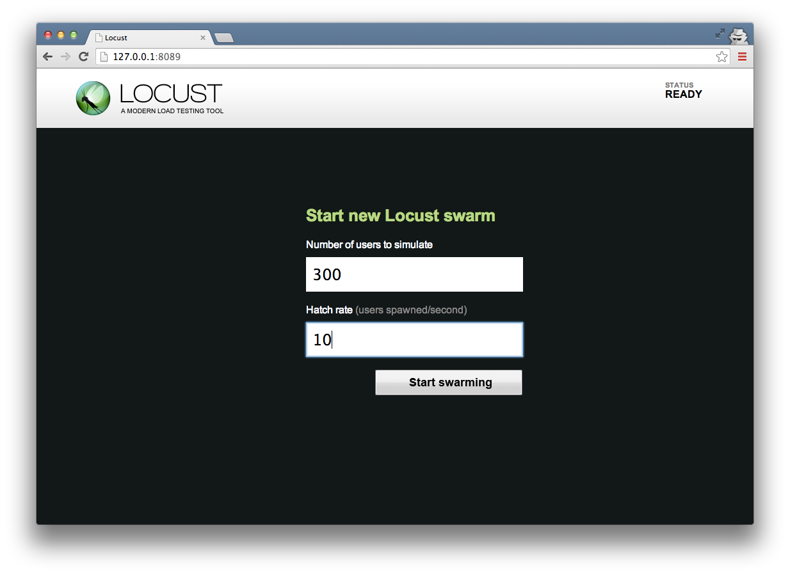

=============
快速开始
=============

locustfile.py 样例
=====================

下面是一个简单的 **locustfile.py** 小例子::

    from locust import HttpLocust, TaskSet
    
    def login(l):
        l.client.post("/login", {"username":"ellen_key", "password":"education"})
    
    def index(l):
        l.client.get("/")
    
    def profile(l):
        l.client.get("/profile")
    
    class UserBehavior(TaskSet):
        tasks = {index:2, profile:1}
        
        def on_start(self):
            login(self)
    
    class WebsiteUser(HttpLocust):
        task_set = UserBehavior
        min_wait = 5000
        max_wait = 9000
    

这里我们定义了一些可以被常规python调用的locust任务，它们接收一个参数(一个Locust类实例)。这些任务汇集在一个 *tasks*
属性的 :py:class:`TaskSet <locust.core.TaskSet>` 类下面。然后我们有一个:py:class:`HttpLocust <locust.core.HttpLocust>`
类来代表一个用户，这里我们定义了一个模拟用户在执行任务之间等待多长时间以及哪个TaskSet类应该定义用户的"行为"。TaskSet是可以嵌套的。

:py:class:`HttpLocust <locust.core.HttpLocust>` 类继承自 :py:class:`Locust <locust.core.Locust>` 类，并且增加了一个
:py:class:`HttpSession <locust.clients.HttpSession>` 实例的client属性，可用于发起HTTP请求。

另一个常用来定义任务的方式是使用@task装饰器，下面的代码等同于上面的代码::

    from locust import HttpLocust, TaskSet, task
    
    class UserBehavior(TaskSet):
        def on_start(self):
            """ on_start is called when a Locust start before any task is scheduled """
            self.login()
        
        def login(self):
            self.client.post("/login", {"username":"ellen_key", "password":"education"})
        
        @task(2)
        def index(self):
            self.client.get("/")
        
        @task(1)
        def profile(self):
            self.client.get("/profile")
    
    class WebsiteUser(HttpLocust):
        task_set = UserBehavior
        min_wait = 5000
        max_wait = 9000

Locust类(以及HttpLocust,因为它是一个子类)也允许一个人去指定最大和最小等待时间-对每一个模拟用户-在执行任务
的间隔(*min_wait* 和 *max_wait*)以及其他用户行为。

启动 Locust
============

使用上面的locust文件来运行Locust，如果文件名是*locustfile.py*,我们可以运行(在和locustfile.py同一目录下)::

    locust --host=http://example.com

或者如果locust文件在其他地方我们可以运行::

    locust -f ../locust_files/my_locust_file.py --host=http://example.com

在多个进程中分布式运行Locust我们可以通过指定 --master 来启动一个master进程::

    locust -f ../locust_files/my_locust_file.py --master --host=http://example.com

然后我们可以启动任意数量的slave进程::

    locust -f ../locust_files/my_locust_file.py --slave --host=http://example.com

如果我们要在多个机器上分布式运行locust，我们还候需要在启动slave的时指定master的host(当在同一台机器上分布式运行locust的
时候是不需要指定的，因为master 的host默认是127.0.01)::

    locust -f ../locust_files/my_locust_file.py --slave --master-host=192.168.0.100 --host=http://example.com

.. note::

    查看所有的可用参数类型
    
        locust --help
    

开启Locust的web接口
==============================

当你采用上述的任意一种方式启动Locust，你就可以打开浏览器并指向http://127.0.0.1:8089(如果你是在本机运行Locust的话)。
然后你就应该看到下图的样子：

